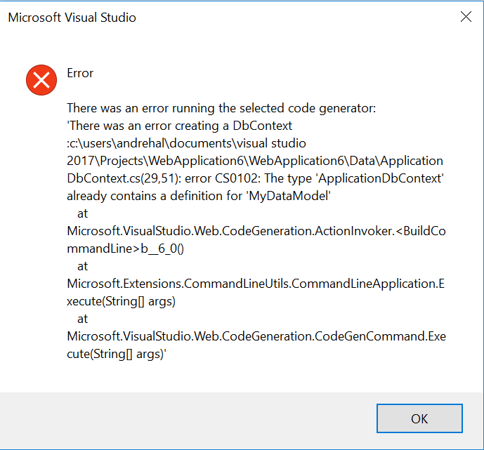

# Known issues for ASP.NET and Web Tools in Visual Studio 2017

## Web Tools Known Issues

### <a href="#iisexpress"></a>ASP.NET projects fail to load after installing Visual Studio 2017 RC Update
Web projects fail to launch with the messages such as : ``` The web project '[project name]' is configured to use IIS Express. You must download and install IIS Express in order to load this project ``` or ``` Initializing the applicationhost.config file failed. Cannot find IIS Express ```

Creation of an ASP.NET project fails with messages such as: ``` Unspecified error (Exception from HRESULT: 0x80004005 (E_FAIL)) ```

* #### Issue:
A bug in the [12/12 Update](https://blogs.msdn.microsoft.com/webdev/2016/12/12/new-updates-to-web-tools-in-visual-studio-2017-rc)  to Visual Studio 2017 RC uninstalls IIS Express during the update.

* #### Workaround:
[Download and install IIS Express 10.0](https://www.microsoft.com/en-us/download/details.aspx?id=48264) 

[*Update 12/15*] : The bug is now fixed in the [12/15 Update](https://blogs.msdn.microsoft.com/webdev/2016/12/12/new-updates-to-web-tools-in-visual-studio-2017-rc) to Visual Studio 2017 RC

### Unable to publish ASP.NET projects after installing Visual Studio 2017 RC Update

Publishing ASP.NET projects gives errors such as: ``` Microsoft Web Deploy is not correctly installed on this machine. Microsoft Web Deploy v3 or higher is recommended ```

* #### Issue: 
A bug in the [12/12 Update](https://blogs.msdn.microsoft.com/webdev/2016/12/12/new-updates-to-web-tools-in-visual-studio-2017-rc)  to Visual Studio 2017 RC uninstalls Web Deploy during the update.

* #### Workaround:
Download and [install Web Deploy 3.6](https://www.microsoft.com/en-us/download/details.aspx?id=43717). 

[*Update 12/15*] : The bug is now fixed in the [12/15 Update](https://blogs.msdn.microsoft.com/webdev/2016/12/12/new-updates-to-web-tools-in-visual-studio-2017-rc) to Visual Studio 2017 RC

### Unable to connect to SQL Server 2016 LocalDb after installing Visual Studio 2017 RC Update

Working with a LocalDb database gives errors such as: ``` A network-related or instance-specific error occurred while establishing a connection to SQL Server. The server was not found or was not accessible. ``` or ``` Unable to locate a Local Database Runtime installation. Verify that SQL Server Express is properly installed and that the Local Database Runtime feature is enabled ```

* #### Issue: 
A bug in the [12/12 Update](https://blogs.msdn.microsoft.com/webdev/2016/12/12/new-updates-to-web-tools-in-visual-studio-2017-rc)  to Visual Studio 2017 RC uninstalls SQL Server 2016 LocalDb during the update.

* #### Workaround:
Download and install [SQL Server 2016 LocalDb](https://www.microsoft.com/en-us/download/details.aspx?id=54284). 

[*Update 12/15*] : The bug is now fixed in the [12/15 Update](https://blogs.msdn.microsoft.com/webdev/2016/12/12/new-updates-to-web-tools-in-visual-studio-2017-rc) to Visual Studio 2017 RC

## .NET Core Known Issues
For known issues with .NET Core, using the following links to see the issues in the .NET Core GitHub repo the team is tracking including comments and status.

* Migration from project.json/xproj to csproj 
    * [Using IDE](https://github.com/dotnet/roslyn-project-system/issues?utf8=%E2%9C%93&q=label%3A%22RC3%20Known%20Issue%22%20label%3A%22Migration%22)
    * [Using command line](https://github.com/dotnet/cli/issues?utf8=%E2%9C%93&q=label%3A%22RC3%20Known%20Issue%22%20label%3Amigration)
* [IDE](https://github.com/dotnet/roslyn-project-system/issues?utf8=%E2%9C%93&q=label%3A%22RC3%20Known%20Issue%22%20)
* [.NuGet](https://github.com/nuget/home/issues?utf8=%E2%9C%93&q=label%3A%22RC3%20Known%20Issue%22%20)
* [MSBuild](https://github.com/Microsoft/msbuild/labels/RC3%20Known%20Issues)
* .NET Core SDK & CLI 
    * [SDK](https://github.com/dotnet/sdk/issues?utf8=%E2%9C%93&q=label%3A%22RC3%20Known%20Issue%22%20)
    * [CLI](https://github.com/dotnet/cli/issues?utf8=%E2%9C%93&q=label%3A%22RC3%20Known%20Issue%22%20)

## ASP.NET Core Known Issues

### Visual Studio 2015 fails to restore NuGet packages after install Visual Studio 2017
After installing Visual Studio 2017 RC on the same machine as Visual Studio 2015 with .NET Core tooling, restoring NuGet packages in an ASP.NET Core project using Visual Studio 2015 fails

* #### Issue: 
On a machine that already has VS 2015 with .NET Core Tooling, if you install VS 2017 RC and then try to restore packages for an ASP.NET project using VS 2015, it might fail with the following error message: 

  MSBUILD : error MSB4025: The project file could not be loaded. Data at the root level is invalid. Line 1, position 1 

* #### Workaround: 
Install the latest update for [.NET Core VS 2015 tooling](https://www.microsoft.com/net/core#windowsvs2015) to resolve the above error. After installing this update, you will be able to restore NuGet packages again using VS 2015.

### Docker enabled project fails to build
Project fails to build if you enable Docker Support without 'Docker for Windows' installed 

* #### Issue:  
When creating an ASP.NET Core project, if you check the "Enable Container (Docker) Support" checkbox but do not have "Docker for Windows" installed, the created project will fail to build with the following error: 

  Microsoft.DotNet.Docker.CommandLineClientException: 'docker-compose' was not found. Please verify that it is available on %PATH%, or for troubleshooting, follow instructions from http://aka.ms/DockerToolsTroubleshooting 

* #### Workaround: 
Install [Docker for Windows](https://docs.docker.com/docker-for-windows/) to resolve the issue

### Error when opening ASP.NET Core project
Error dialog with message : The project system has encountered an error. Could not resolve mscorlib for target framework '.NETCoreApp,Version=v1.0' 

* #### Issue: 
When you create or re-open an ASP.NET Core project, you might sometimes see this error dialog: 

  The project system has encountered an error. Could not resolve mscorlib for target framework '.NETCoreApp,Version=v1.0' 

* #### Workaround: 
Restart Visual Studio and try again

### No suggestions to install missing packages
Ctrl+. Light Bulbs does not work with extension methods in .NET Core or ASP.NET Core projects 

* #### Issue: 
Pressing Ctrl+. on unresolved references to extension methods does not provide a lightbulb with helpful shortcuts to install the required package 

* #### Workaround: 
Manually find and install the package using Manage NuGet packages UI

### Tag Helpers do not work
Razor Tag Helpers do not work in .NET Core projects 

* #### Issue: 
Razor Tag Helpers do not get colorization or special IntelliSense at design time in RC.  They work normally at runtime. 

* #### Workaround: 
None available

### TypeScript files do not compile
TypeScript files not compiled in .NET Core projects 

* #### Issue: 
TypeScript files are not automatically compiled on save in .NET Core projects 

* #### Workaround: 
Add a tsconfig.json file to the root of the project, containing at least {}.

### Scaffolding broken
Scaffolding broken for ASP.NET Core (.NET Framework) templates 

* #### Issue: 
[CLI is not generating the assembly redirects for project dependency tools](https://github.com/dotnet/cli/issues/4666) 

* #### Workaround: 
None

### Sequence numbers added to wronge item templates
Sequence numbers are added to inappropriate Item Templates 

* #### Issue: 
In Core projects, item templates such as "npm Configuration File", "Bower Configuration File", "Grunt/Gulp Configuration File", etc., which work only with specific names, are created with an extra "1" inserted before the end of the file name. 

* #### Workaround: 
Edit the supplied file name before or after creating the file. 

### Bundle and Minify not working
Bundle and Minify is not operating in Core projects created from VS project templates

* #### Issue:
Bundle and Minify commands are commented out in csproj files created from project templates.

* #### Workaround:
  * Create a Core web application project
  * Right-click on the project node in Solution Explorer and select "Exid [projectname].csproj
  * Ignore the warning about line enndings.  (Known issue.)
  *  At the botom of the csproj file, find:
  ```xml
   <Target Name="BeforePublish">
    <Exec Command="bower install" />
    <Exec Command="dotnet bundle" />
  </Target>
```
Replace with:
```xml
   <Target Name="BeforePublish">
    <!--
    <Exec Command="bower install" />
    -->
    <Exec Command="dotnet bundle" />
  </Target>
  ```
(The bower install command is not ready for RC and will be fixed in an upcoming release.)
To invoke bundling and minification, publish the project.  For example, publish to file system.

### Scaffolded files not included in project
Scaffolded files may not be included in user's project in certain cases, where user's project defines exclusions.

* #### Issue:  
If user project has a globbing pattern for ```<Compile>``` item group with a exclude pattern. And if the files generated by scaffolding match the pattern, they are not included in the project. For example: If project has ```<Compile Include = "**/*.cs" Exclude="ExcludedDir/*.cs" />``` and scaffolding generates a file in 'DefaultController.cs' ExcludedDir, it will not be included in the project for compilation. 

* #### Workaround: 
Manually adjust the globbing pattern to include the 'ExcludedDir/DefaultController'

### Core Console/Class library  publish dialog not showing the right RID's
The Publish profile settings dialog for a .NET Core Console/Class library does not show the right RID's

* #### Issue: 
Core Console/Class lib Publish Profile Settings Dialog shows only Portable RID when the user wants to add a RID by adding a RuntimeIdentifier element in the project file 

* #### Workaround:
If the user wants to only add one runtime identifier to the project, instead of adding the RuntimeIdentifier element, add a RuntimeIdentifiers element, for example:

```XML
<RuntimeIdentifiers>win7-x86</RuntimeIdentifiers>
```

### Published .exe of a .NET Core Console App sometimes fails when running
The published .exe of a Console App with a win7-x86 RID and Release configuration sometimes fails when running

* #### Issue: 
After publishing a Console App with a win7-x86 RID and Release configuration, running the published .exe sometimes gives the error: 'Unhandled Exception: System.BadImageFormatException: Could not load file or assembly 'CoreConsoleProject.dll'. An attempt was made to load a program with an incorrect format.'

* #### Workaround:
Run dotnet new before publishing.

### Ambiguity error during scaffolding controller with Entity Framework
Error message regarding ambiguity between DataContext member names during scaffolding controller using EntityFrameworkCore

* #### Issue:
If the DataContext class has a member (property, method, variable) defined with the same name as the Model class being used for scaffolding fails with an error as below:<br/>


* #### Workaround:
Add a DbSet<> property to the DataContext class for the model which will be used for scaffolding manually and then retry scaffolding
`public DbSet<ClassName> MemberName { get; set; }`

## Issues fixed as of [the 01/26 update for Visual Studio 2017 RC](https://blogs.msdn.microsoft.com/webdev/2017/01/26/updates-to-web-tools-in-visual-studio-2017-rc/)

### Error when opening ASP.NET Core project
Error dialog with message : The project system has encountered an error. Could not resolve mscorlib for target framework '.NETCoreApp,Version=v1.0' 

* #### Issue: 
When you create or re-open an ASP.NET Core project, you might sometimes see this error dialog: 

  The project system has encountered an error. Could not resolve mscorlib for target framework '.NETCoreApp,Version=v1.0' 

* #### Workaround: 
Install [the 01/26 update for Visual Studio 2017 RC](https://blogs.msdn.microsoft.com/webdev/2017/01/26/updates-to-web-tools-in-visual-studio-2017-rc/)

### Scaffolding broken
Scaffolding broken for ASP.NET Core (.NET Framework) templates 

* #### Issue: 
[CLI is not generating the assembly redirects for project dependency tools](https://github.com/dotnet/cli/issues/4666) 

* #### Workaround: 
Install [the 01/26 update for Visual Studio 2017 RC](https://blogs.msdn.microsoft.com/webdev/2017/01/26/updates-to-web-tools-in-visual-studio-2017-rc/)

### Migrations not applied during publish
Cannot apply migrations during publish of ASP.NET Core project

* #### Issue:
Ability to provide a destination connection string and apply migrations are not available in the Publish Settings for an ASP.NET Core project

* #### Workaround:
You need to manually apply migrations on the destination database server

### Unable to publish
Unable to publish ASP.NET Core Web Application (.NET Framework)

* #### Issue:
If you try to publish an ASP.NET Core Web Application (.NET Framework), you will run into the following error: "DestinationFiles" refers to 1 item(s), and "SourceFiles" refers to 2 item(s). They must have the same number of items

* #### Workaround:
None available

### Publish crashes
Publish crashes on locales that do not use '.' as a decimal separator

* #### Issue:
A bug in publishing fails to distinguish decimal separators in a language-neutral way.

* #### Workaround:
Before publishing, set VS locale to ENU.

### Cannot configure web server settings
Property pages of ASP.NET Core projects do not allow you to configure Web Server Settings

* #### Issue:
Web Server settings such as App URL, ability to enable SSL, Windows Authentication are not available in the property pages of an ASP.NET Core project

* #### Workaround:
You can edit the launchSettings.json file and apply settings similar to .NET Core tooling in Visual Studio 2015

### Razor IntelliSense not working
Razor IntelliSense Completion issues in .NET Core projects

* #### Issue:
Completion at the end of razor expressions doesn't work well in RC. eg, typing "@DateTi." or "@DateTime." (w/o the quotes) will not commit properly, and may mark the dot as markup.  Please report any additional IntelliSense Issues using "Send Feedback."

* #### Workaround:
Backspace one character and retry

### Scaffolded files not included in project
Scaffolded files may not be included in user's project in certain cases, where user's project defines exclusions.

* #### Issue:  
If user project has a globbing pattern for ```<Compile>``` item group with a exclude pattern. And if the files generated by scaffolding match the pattern, they are not included in the project. For example: If project has ```<Compile Include = "**/*.cs" Exclude="ExcludedDir/*.cs" />``` and scaffolding generates a file in 'DefaultController.cs' ExcludedDir, it will not be included in the project for compilation. 

* #### Workaround: 
Manually adjust the globbing pattern to include the 'ExcludedDir/DefaultController

### Bower packages fail to restore
Bower Restore fails to restore packages 
 
* #### Issue: 
Bower Restore does not function, and IntelliSense for version numbers in bower.json always returns "*".  Attempt to restore displays the following in the Output Window (Bower/npm pane): 

  ECMDERR Failed to execute "git ls-remote --tags --heads https://github.com/lodash/lodash.git", exit code of #128 

* #### Workaround: 
Install [the 12/12 update for Visual Studio 2017 RC](https://blogs.msdn.microsoft.com/dotnet/2016/12/12/updating-visual-studio-2017-rc-net-core-tooling-improvements)

### Long time before all files are visible in Solution Explorer
After creating a .NET Core or ASP.NET Core project, you need to wait until package restore completes 

* #### Issue: 
As soon as creating a .NET Core or ASP.NET Core project, you will see a message in the status bar that it is restoring some packages. While this package restore is in progress, you will not be able to view all the files in Solution Explorer or build the project. If you tried to build a project while package restore is in progress, you might also see a dialog with the message "The build must be stopped before the project can be closed".  

* #### Workaround: 
Install [the 12/12 update for Visual Studio 2017 RC](https://blogs.msdn.microsoft.com/dotnet/2016/12/12/updating-visual-studio-2017-rc-net-core-tooling-improvements)

### Entity Framework commands to not work
Entity Framework Commands do not work in Package Manager Console 

* #### Issue: 
Entity Framework powershell command integration with msbuild is not yet complete, and Microsoft.EntityFrameworkCore.Design is omitted from ASP.NET Core Web Application with Individual Authentication project template. 

* #### Workaround: 
Install [the 12/12 update for Visual Studio 2017 RC](https://blogs.msdn.microsoft.com/dotnet/2016/12/12/updating-visual-studio-2017-rc-net-core-tooling-improvements)

### Error running app with Windows Authentication
Error running Core Apps using Windows Authentication 

* #### Issue: 
There is an error in the project template processing code, and $webserverport1$ is not replaced with the randomly generated port number. 

* #### Workaround: 
Install [the 12/12 update for Visual Studio 2017 RC](https://blogs.msdn.microsoft.com/dotnet/2016/12/12/updating-visual-studio-2017-rc-net-core-tooling-improvements)

