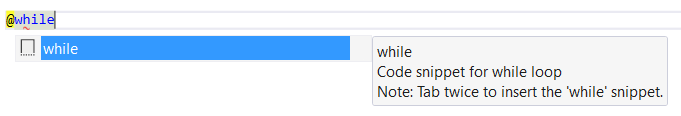
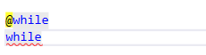
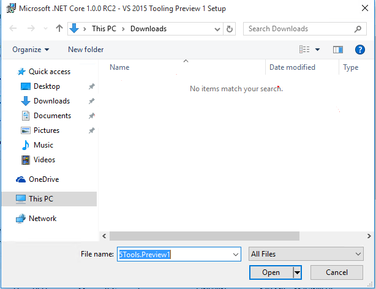
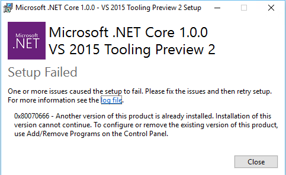
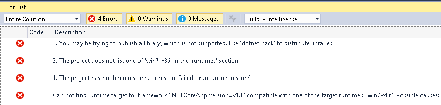
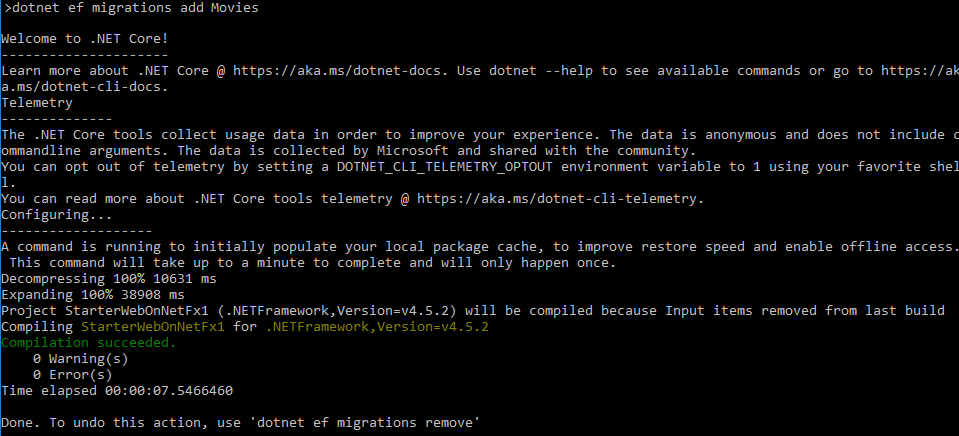
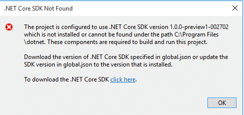
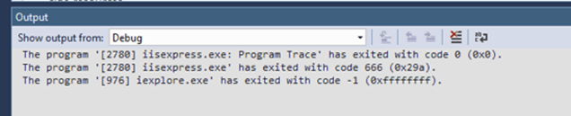
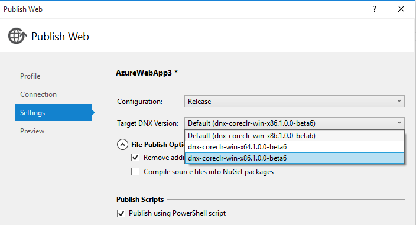

# Known issues for ASP.NET Core support in Visual Studio 2015

## .NET Core 1.0 - VS 2015 Tooling RC

### Razor IntelliSense

● **Issue**: IntelliSense adds extra characters in certain circumstances
&nbsp;&nbsp;&nbsp;&nbsp;In the Razor editor, if you type ```@``` then some C# code, and you commit statement completion with the word fully typed out, additional characters will get added to the editor. For example, if you type ```@while``` then tab or space, an extra "while" will get added to the editor.




&nbsp;&nbsp;&nbsp;&nbsp;**Workaround**: Either do not type out the whole word, or dismiss statement completion.

&nbsp;&nbsp;&nbsp;&nbsp;**Fix**: We are working on a fix and will be delivered as an update to Visual Studio Update 3.

### Setup

● **Issue**:Error on uninstall when the original installer has been deleted.
&nbsp;&nbsp;&nbsp;&nbsp;In some cases if you have previously installed ".NET Core RC2 Tooling Preview 1" or "ASP.NET 5 RC1" and you try to uninstall it, you might run into the following dialog. This can happen if you previously downloaded the installer to the Downloads folder but it's not there anymore. 



&nbsp;&nbsp;&nbsp;&nbsp;**Workaround**: Download the original installer and use that to uninstall link. Download links below.

 - RC2 (TBD)
 - RC1 U1 with MSRC (TBD)
 - RC1 U1 ([1.0.11123.0](http://download.microsoft.com/download/B/0/A/B0AEBD7D-6979-4265-B1AC-A0B73618FB22/AspNet5.ENU.RC1_Update1.exe))
 - RC1 U1 we shipped for Azure SDK 2.8 ([1.0.11125.0](http://download.microsoft.com/download/D/E/B/DEB395C9-C875-47F3-96F7-55C9A8FCD869/AspNet5.ENU.RC1_Update1.exe))
 - RC1 U1 we shipped for Visual Studio as part of an updated Web Developer Tools ([1.0.20204.0](http://download.microsoft.com/download/1/8/0/18048EDD-9F45-479A-B208-6F7C91CF2ECC/AspNet5.ENU.RC1_Update1_KB3137909.exe))
 - RC1 (without U1) ( [here](https://www.microsoft.com/en-us/download/details.aspx?id=49959))

&nbsp;&nbsp;&nbsp;&nbsp;**Fix**: n/a

● **Issue**:Setup failed: another version already installed
&nbsp;&nbsp;&nbsp;&nbsp;In some cases you may get an error dialog on setup with an error message "0x80070666 - Another version of this product is already installed."



&nbsp;&nbsp;&nbsp;&nbsp;**Workaround**: See the [Known issues](https://msdn.microsoft.com/en-us/vs-knownissues/vs2015-update3-rc) page for Visual Studio 2015 Update 3 RC for additional details.

&nbsp;&nbsp;&nbsp;&nbsp;**Fix**: n/a

● **Issue**:Multiple entries found in Add Remove Programs
&nbsp;&nbsp;&nbsp;&nbsp;When upgrading tooling, previous versions continue to show up in Add/Remove Programs. This typically happens when the previous bundle is being removed as part of the upgrade and fails to locate the original source of the installer. 		The log files for the uninstall would contain entries similar to this

```			
[47B8:0798][2016-06-24T18:36:44]w210: Plan skipped due to 1 remaining dependents
[47B8:0798][2016-06-24T18:36:44]i207: Planned related bundle: {58140f9c-9a01-4e20-bc5f-8ca652fd3ec4}, type: Upgrade, default requested: None, ba requested: None, execute: None, rollback: None, dependency: None
```	

&nbsp;&nbsp;&nbsp;&nbsp;**Workaround**: Leaving the previous bundle in Add/Remove Programs should not cause any problems. You can remove it by following the steps below. __Note: these steps require registry updates, please use caution.__

 1. Open REGEDIT
 1. Under `HKCR\Installers\Dependencies` find subkeys using the GUIDs from the log messages. For example from the log above `HKCR\Installers\Dependencies\{GUID}\Dependents\{58140f9c-9a01-4e20-bc5f-8ca652fd3ec4}`
 1. Only delete the highlighted registry key above and run the uninstall again 

&nbsp;&nbsp;&nbsp;&nbsp;**Fix**: n/a 

### Project System

● **Issue**: Variables not appearing in debugger for Razor views
&nbsp;&nbsp;&nbsp;&nbsp;During debugging, when you hit a breakpoint in C# code in a Razor page, you cannot get information about variables in the watch window. 


&nbsp;&nbsp;&nbsp;&nbsp;**Workaround**: None

&nbsp;&nbsp;&nbsp;&nbsp;**Fix**: We are working on a fix and will be delivered as an update to Visual Studio Update 3.

● **Issue**: IIS Express fails start after copying a project/solution from one folder to another.
&nbsp;&nbsp;&nbsp;&nbsp;<description>

&nbsp;&nbsp;&nbsp;&nbsp;**Workaround**: Close all instances of Visual Studio and delete the `.vs` folder.

&nbsp;&nbsp;&nbsp;&nbsp;**Fix**: We are working on a fix to be included in a future release of .NET Core Tooling.

● **Issue**: Poor error experience for "Can not find runtime target framework"
&nbsp;&nbsp;&nbsp;&nbsp; In some cases you may see multiple errors relating to "Can not find runtime target for framework..."



&nbsp;&nbsp;&nbsp;&nbsp;**Workaround**: None

&nbsp;&nbsp;&nbsp;&nbsp;**Fix**: We are investigating.


● **Issue**: Errors shown in `project.json` for valid packages
&nbsp;&nbsp;&nbsp;&nbsp; In some cases when the `project.json` file is open in the editor it will show errors for packages which were restored fine. The exact details are still under investigation.

&nbsp;&nbsp;&nbsp;&nbsp;**Workaround**: You can ignore the squiggles and error messages for these packages.

&nbsp;&nbsp;&nbsp;&nbsp;**Fix**: We are investigating.

### EF Migrations

● **Issue**: Package cache executes on first EF migration command
&nbsp;&nbsp;&nbsp;&nbsp; When you run ```dotnet ef migrations``` or other dotnet commands, you might see that it takes a while for dotnet CLI to populate the local package cache. This is expected and should only happen one-time per user on the machine.



&nbsp;&nbsp;&nbsp;&nbsp;**Workaround**: There is no impact after the initial delay.

&nbsp;&nbsp;&nbsp;&nbsp;**Fix**: We are investigating.

● **Issue**: Running ```dotnet ef``` from command-line fails when IIS Express is running
&nbsp;&nbsp;&nbsp;&nbsp;When working with ef migrations from the command line, for example, when running a command like ```dotnet ef migrations add Initial``` you may get an error similar to the following.

```
C:\3\MvcMovie\src\MvcMovie>dotnet ef migrations add Initial
Project MvcMovie (.NETCoreApp,Version=v1.0) will be compiled because project is not safe for incremental compilation. Use --build-profile flag for more information.
Compiling MvcMovie for .NETCoreApp,Version=v1.0
C:\Program Files\dotnet\dotnet.exe compile-csc @C:\3\MvcMovie\src\MvcMovie\obj\Debug\netcoreapp1.0\dotnet-compile.rsp returned Exit Code 1
Compilation failed.
C:\3\MvcMovie\src\MvcMovie\error CS2012: Cannot open 'C:\3\MvcMovie\src\MvcMovie\bin\Debug\netcoreapp1.0\MvcMovie.dll' for writing -- 'The process cannot access the file 'C:\3\MvcMovie\src\MvcMovie\bin\Debug\netcoreapp1.0\MvcMovie.dll' because it is being used by another process.'
    0 Warning(s)
    1 Error(s)
Time elapsed 00:00:04.3201268
Build failed on 'MvcMovie'.
```

&nbsp;&nbsp;&nbsp;&nbsp;**Workaround**: : Exit IIS Express from the system tray. This will unlock the dll and allow the command to run.

&nbsp;&nbsp;&nbsp;&nbsp;**Fix**: We are investigating.

### Publish

● **Issue**: Errors when publishing with EF migrations on Windows 7
&nbsp;&nbsp;&nbsp;&nbsp; If you publish a web project with EF migrations on Windows 7 you may get an error due to missing commands. This is because the current script uses features which require PowerShell v3.

&nbsp;&nbsp;&nbsp;&nbsp;**Workaround**: Install PowerShell v3

&nbsp;&nbsp;&nbsp;&nbsp;**Fix**: We are working on a fix which should be included in a future release of .NET Core Tooling.

● **Issue**: Register functionality of app fails if EF Migrations were not applied
&nbsp;&nbsp;&nbsp;&nbsp; After publishing a project that includes authentication, the app will fail to run if EF Migrations were not applied on publish.

&nbsp;&nbsp;&nbsp;&nbsp;**Workaround**: Update the publish profile to execute EF Migrations. This can be found on the Settings tab of the Publish Web dialog.

&nbsp;&nbsp;&nbsp;&nbsp;**Fix**: None

### Scaffolding

● **Issue**:  Compiler error while scaffolding an MVC controller 
&nbsp;&nbsp;&nbsp;&nbsp; In some cases you may get an error dialog when scaffolding.

```
---------------------------
Microsoft Visual Studio
---------------------------
Error

There was an error running the selected code generator:

'Project WebApplication6 (.NETCoreApp,Version=v1.0) will be compiled because project is not safe for incremental compilation. Use --build-profile flag for more information.
Compiling WebApplication6 for .NETCoreApp,Version=v1.0
Running with configuration from C:\temp\WebApplication6\src\WebApplication6\bundleconfig.json
Processing wwwroot/css/site.min.css
  Bundled
  Minified
Processing wwwroot/js/site.min.js
Compilation failed.
    0 Warning(s)
    1 Error(s)
Time elapsed 00:00:05.9348301'
---------------------------
OK   
---------------------------
```

See https://github.com/aspnet/Scaffolding/issues/258

&nbsp;&nbsp;&nbsp;&nbsp;**Workaround**: Retry scaffolding

&nbsp;&nbsp;&nbsp;&nbsp;**Fix**: We are investigating

● **Issue**: Bad experience scaffolding when the project fails to build.
&nbsp;&nbsp;&nbsp;&nbsp; Scaffolding output doesn't contain the compilation errors if the project compilation fails during scaffolding. For example here is the actual output.

```
Build Failed
Project WebApplication8 (.NETCoreApp,Version=v1.0) will be compiled because project is not safe for incremental compilation. Use --build-profile flag for more information.
Compiling WebApplication8 for .NETCoreApp,Version=v1.0
RunTime 00:00:08.53
Running with configuration from C:\Users\fwtlaba\Documents\Visual Studio 2015\Projects\WebApplication8\src\WebApplication8\bundleconfig.json
Processing wwwroot/css/site.min.css
  Bundled
  Minified
Processing wwwroot/js/site.min.js
Compilation failed.
    0 Warning(s)
    1 Error(s)
Time elapsed 00:00:06.6119118
```

And the expected output.

```
Build Failed
Project WebApplication8 (.NETCoreApp,Version=v1.0) will be compiled because project is not safe for incremental compilation. Use --build-profile flag for more information.
Compiling WebApplication8 for .NETCoreApp,Version=v1.0
Running with configuration from C:\Users\fwtlaba\Documents\Visual Studio 2015\Projects\WebApplication8\src\WebApplication8\bundleconfig.json
Processing wwwroot/css/site.min.css
  Bundled
  Minified
Processing wwwroot/js/site.min.js
C:\Program Files\dotnet\dotnet.exe compile-csc @C:\Users\fwtlaba\Documents\Visual Studio 2015\Projects\WebApplication8\src\WebApplication8\obj\Debug\netcoreapp1.0\dotnet-compile.rsp returned Exit Code 1
C:\Users\fwtlaba\Documents\Visual Studio 2015\Projects\WebApplication8\src\WebApplication8\Program.cs(21,23): error CS1002: ; expected

Compilation failed.
    0 Warning(s)
    1 Error(s)

Time elapsed 00:00:09.4108500
```

See https://github.com/aspnet/Scaffolding/issues/260

&nbsp;&nbsp;&nbsp;&nbsp;**Workaround**: None

&nbsp;&nbsp;&nbsp;&nbsp;**Fix**: We are investigating.

● **Issue**: Scaffolding MVC w/views assumes the presence of _ValidationScriptsPartial.cshtml
&nbsp;&nbsp;&nbsp;&nbsp; When scaffolding a new MVC controller with views using Entity Framework, the Create and Edit views reference _ValidationScriptsPartial.cshtml, which is only included in the Individual Auth template, causing this error in other templates:

```
InvalidOperationException: The partial view '_ValidationScriptsPartial' was not found. The following locations were searched:
 /Views/Movies/_ValidationScriptsPartial.cshtml
 /Views/Shared/_ValidationScriptsPartial.cshtml
```

&nbsp;&nbsp;&nbsp;&nbsp;**Workaround**: Copy `_ValidationScriptsPartial.cshtml` from a new project. 

&nbsp;&nbsp;&nbsp;&nbsp;**Fix**: We are investigating.

See https://github.com/aspnet/Scaffolding/issues/257

● **Issue**: Connection string is added in a different location than the templates
&nbsp;&nbsp;&nbsp;&nbsp; If you use scaffolding to create a dbcontext while creating a controller it will add a connection string to appsettings.json and the code to read it in ConfigureServices. However, it's still using the location and APIs that were used in the RC1 templates and does not match the RC2 or RTM templates.

&nbsp;&nbsp;&nbsp;&nbsp;**Workaround**: After scaffolding move the connection string to the desired location.

&nbsp;&nbsp;&nbsp;&nbsp;**Fix**: We are working on a fix which should be included in a future version of .NET Core Tooling.

See https://github.com/aspnet/Scaffolding/issues/259 

● **Issue**: Scaffolding fails when model class is in a different project.
&nbsp;&nbsp;&nbsp;&nbsp; Scaffolding fails if model class is in a dependency (project/ library) of the project on which scaffolding is being run.

&nbsp;&nbsp;&nbsp;&nbsp;**Workaround**: None

&nbsp;&nbsp;&nbsp;&nbsp;**Fix**: We are investigating.

## .NET Core 1.0.0 RC2 – VS 2015 Tooling Preview 1

Known issues in this release.

Note: There is a known issue with Visual Studio 2015 Update 3 RC, as a result of which, .NET Core 1.0.0 RC2 - VS 2015 Tooling Preview 1 may fail to install after Visual Studio 2015 Update 3 RC is installed. [See here](https://go.microsoft.com/fwlink/?LinkId=808095) for additional details and workaround.

### Missing SDK

If you open an RC2 project (or RTW) and the corresponding .NET Core SDK is missing you'll get a dialog box similar to the following.



To workaround this you can install the correct version of the .NET SDK. You can use the links below.

#### RC2 SDK download links

| Platform    | Link          |
|-------------|---------------|
| Windows x64 | https://go.microsoft.com/fwlink/?LinkID=798398 |
| Windows x86 | https://go.microsoft.com/fwlink/?LinkID=798399 |

#### RTM SDK download links

| Platform    | Link          |
|-------------|---------------|
| Windows x64 | https://dotnetcli.blob.core.windows.net/dotnet/preview/Installers/Latest/dotnet-dev-win-x64.latest.exe |
| Windows x86 | https://dotnetcli.blob.core.windows.net/dotnet/preview/Installers/Latest/dotnet-dev-win-x86.latest.exe |

For more info see https://github.com/dotnet/cli/#installers-and-binaries

### Add New Item

In some cases the Add New Item dialog will select the wrong item by default. For example with the PowerShell tools installed when you start Add New Item one of the PowerShell templates may be selected by default. This is also impacting the Add Class menu option.

### Debugging Unhandled Exception dialog does not appear

In some cases the Unhandled Exception dialog does not appear when it should.

### Scaffolding

#### Limited to Web Individual Auth
Scaffolding is currently limited to the Web template with Individual Authentication. We are hoping to support scaffolding for all projects in the next release.

#### Connection string and EF Migrations on publish

Currently the scaffolding feature directly embeds the connection string into code. This doesn't work well if you also use the EF Migrations publish feature. To get these two to work well together, move the connection string from code into the `appsettings.json` file.

### Publish

#### Azure Web Apps

The shared framework is not available in Azure Web Apps yet. We are working on getting it included.

#### Publishing RC1 projects with RC2 tooling publishes source files

When publishing an RC1 project with RC2 tooling, source files will be published even if you checked the "No Source" checkbox in RC1. To change to publishing binaries you'll need to modify the publish profile (.pubxml file under Properties\PublishProfiles) to include the following. For details on the workaround see http://stackoverflow.com/a/37425515.

#### Target runtime dropdown

In some cases the target runtime debug dropdown doesn't get populated correctly. 

#### Preview always shows appsettings.production.json as delete

The web publish dialog always shows `appsettings.production.json` as being deleted even when it will not.

#### Publish and Org Auth projects

In some cases after publishing a project using Org Auth, the published application may fail to run.

### General

#### Dependencies not copied to the output folder

In some cases all dependencies are not copied to the output folder.

### AI+ Work & School Account + SSO (no Read/Write)

You may get an error when using Work and School accounts and AI.

More info: https://github.com/aspnet/Templates/issues/569

#### BrowserLink and signed applications

Microsoft.VisualStudio.Web.BrowserLink.Loader package cannot be loaded in a signed web application. app.UseBrowserLink() must be removed for the application to run.

#### Property Page update while open

Having property page open and modifying properties in project.json doesn't update property page

#### IIS Express is an option for Console applications

IIS express shows up as an option in the Launch drop down on Debug page for Console Application

#### Issues with project-to-project references

There are some issues when using an .xproj  referencing a .csproj.

All outputs may not be copied to the output folder. For example when using reference assemblies.

[Roslyn #10471](https://github.com/dotnet/roslyn/issues/10471) - Portable Class library - > Platform target 'AnyCPU' is not supported by one or more of the project's targets.

[dotnet cli #2961](https://github.com/dotnet/cli/issues/2961) - Runtime error after add reference from xproj web app (netcoreapp) to PCL csproj with project.json (netstandard)


## ASP.NET 5 RC1


Here are the known issues with ASP.NET 5 RC1


#### Tooling issues related to install of ASP.NET 5 RC1

1. If you install ASP.NET 5 RC1 on a machine without Visual Studio 2015, then install Visual Studio 2015 later, you will need to repair 'ASP.NET 5 RC1' in Add/Remove programs to get tooling support in Visual Studio 2015 for ASP.NET 5 RC1

2. If you install ASP.NET 5 RC1 on a machine that already has Visual Studio 2015, then install a VS 2015 language pack, you will need to repair 'ASP.NET 5 RC1' in Add/Remove programs to get tooling support in Visual Studio for web projects

3. After installing RC1 Update 1, Browser Link may be disabled in DNX projects that are created after the installation.  If the Browser Link Dashboard displays "No current connections" when running or debugging a DNX project a repair of the update will correct the issue:
    1.	Close Visual Studio
    2.	Open Control Panel > Uninstall a Program
    3.	Right click on "Microsoft ASP.NET 5 RC1 Update 1"
    4.	Click "change"
    5.	In the ASP.NET 5 RC1 Update 1 Installer, click "Repair"

4. Visual Studio keeps showing suggested extensions in the yellow info bar when opening an HTML file. It also shows an error message when there are Git merge conflicts or with Annotate and Excluded Folder documents.
[More details here](http://blogs.msdn.com/b/webdev/archive/2016/01/12/visual-studio-keeps-showing-suggested-extensions.aspx).

## ASP.NET 5 Beta8

Here are the known issues with ASP.NET 5 Beta8

#### ComponentModelCache needs to be cleared

Visual Studio caches some of it's internal state in the `ComponentModelCache` folder. In some cases this cache may be invalidated, but not updated correctly. The result is that you may run into a number of errors which cannot be explained directly.

For example any of the following error messages could indicate an issue with an invalid `ComponentModelCache`.

```
System.ArgumentException: Item has already been added. Key in dictionary: 'RazorSupportedRuntimeVersion'
```

```
    This project is incompatible with the current edition of Visual Studio:

    Microsoft Visual Studio Community 2015 Version 14.0.23107.0 D14REL
    Microsoft .NET Framework
    Version 4.6.00079

```

**Workaround**

To work around this.

 1. Close all instances of Visual Studio
 2. Delete the folder at `%localappdata%\Microsoft\VisualStudio\14.0\ComponentModelCache`
 3. Restart Visual Studio

#### Issues with NuGet

If you experience any issues with NuGet packages not being resolved, or being resolved to unexpected versions. The best thing to try install the latest version of NuGet from https://visualstudiogallery.msdn.microsoft.com/5d345edc-2e2d-4a9c-b73b-d53956dc458d/file/146283/8/NuGet.Tools.vsix.

Some examples off issues that may be resolved by updating NuGet are below.

 - NuGet feed for nuget.org is disabled
 - Package restore returns `beta8` packages instead of `beta5` packages

#### System beep on stop debugging

With ASP.NET 5 Beta8 we have changed how web applications are hosted with the Visual Studio debugger. In this release when you stop debugging you may notice there is a system beep that occurs at the end of debugging. This is a known issue that should be fixed with the first update for Visual Studio 2015 itself. The only workaround is to disable system sounds for this release. There is no functional impact.

## ASP.NET 5 Beta6

#### First F5 with IIS Express may not work

Sometimes, after you create an ASP.NET Web Application project for the first time, when you hit F5 for the first time, iisexpress.exe will exit with error code 666.



**Workaround**

If you run into this error you should be able to hit F5 again to get the project to launch correctly.

#### Access Denied when installing DNX runtime using DNVM

In some cases, when creating an ASP.NET 5 project, DNVM fails to install the DNX runtime, and you will see the following error in the DNVM log:

```
Installing to C:\Users\balach\.dnx\runtimes\dnx-clr-win-x86.1.0.0-beta6
Move-Item : Access to the path 'C:\Users\balach\.dnx\runtimes\temp\dnx-clr-win-x86.1.0.0-beta6' is denied.
At C:\Program Files\Microsoft DNX\Dnvm\dnvm.ps1:1156 char:17
+                 Move-Item $UnpackFolder $RuntimeFolder
+                 ~~~~~~~~~~~~~~~~~~~~~~~~~~~~~~~~~~~~~~
    + CategoryInfo          : WriteError: (C:\Users\balach...x86.1.0.0-beta6:DirectoryInfo) [Move-Item], IOException
    + FullyQualifiedErrorId : MoveDirectoryItemIOError,Microsoft.PowerShell.Commands.MoveItemCommand

Cannot find dnx-clr-win-x86.1.0.0-beta6, do you need to run 'dnvm install 1.0.0-beta6'?
At C:\Program Files\Microsoft DNX\Dnvm\dnvm.ps1:1268 char:9
+         throw "Cannot find $runtimeFullName, do you need to run '$Com ...
+         ~~~~~~~~~~~~~~~~~~~~~~~~~~~~~~~~~~~~~~~~~~~~~~~~~~~~~~~~~~~~~
    + CategoryInfo          : OperationStopped: (Cannot find dnx...l 1.0.0-beta6'?:String) [], RuntimeException
    + FullyQualifiedErrorId : Cannot find dnx-clr-win-x86.1.0.0-beta6, do you need to run 'dnvm install 1.0.0-beta6'?

Installing to C:\Users\balach\.dnx\runtimes\dnx-coreclr-win-x86.1.0.0-beta6
Adding C:\Users\balach\.dnx\runtimes\dnx-coreclr-win-x86.1.0.0-beta6\bin to process PATH
Compiling native images for dnx-coreclr-win-x86.1.0.0-beta6 to improve startup performance...
```

**Workaround**

Restart Visual Studio and try creating the project again. DNVM should succeed this time.

#### For a project targeting only CoreCLR (dnxcore50), you could run into a failure during Publish

If you update your ASP.NET 5 web project to target only CoreCLR (only dnxcore50 in project.json), you might run into the following failure when you try to Publish with the default Publish settings.

```
The "Dnu" task failed unexpectedly.
The project being published does not support the runtime 'dnx-clr-win-x86.1.0.0-beta6'
```

**Workaround**

In the Settings tab of the Publish dialog, explicitly select dnx-coreclr as the target rather than using the 'Default'. See the image below.



## ASP.NET Beta5 / Visual Studio 2015 RTM

## Visual Studio 2015 RC

#### applicationHost.config file appears as an untracked file in Solution

The applicationHost.config file will sometimes appear as an untracked file in Solution Explorer. This file should not be checked in as it has user specific paths which will not work in team environments.

#### Removing dnx451 from project.json frameworks may lead to erroneous build errors for ASP.NET 5 Web Sites projects

If you remove the dnx451 value from the frameworks section in project.json for ASP.NET 5 Web Site projects you may receive an error similar to "The type or namespace name 'AspNet' does not exist in the namespace 'Microsoft' (are you missing an assembly reference?)". To work around this you can remove the file at Compiler\Preprocess\RazorPreCompilation.cs.

#### Unable to add a reference to a standard C# project (.csproj) from an ASP.NET 5 project which is missing global.json

If you are working in a solution with ASP.NET 5 projects that does not have a global.json file you may not be able to add a reference to a standard C# project (.csproj) from an ASP.NET 5 project.

#### Installing dnvm x64 CoreClr without installing the corresponding x86 version may cause errors

If you install an x64 CoreClr version of dnvm and use that as the default then you may get error message like "Cannot find the DNX runtime '<version>' … ". To work around this install the corresponding x86 version as well.

#### Publishing using Web Express may incorrectly report a failed status

When publishing using Visual Studio 2015 Web Express you may receive an error like "The InstallDir property does not exist in the path HKEY_LOCAL_MACHINE\SOFTWARE\ Wow6432Node\Microsoft\VisualStudio\14.0." Even though this error is reported in most cases the site is actually published.

#### IntelliSense for version in bower.json may not work on localized builds

If you are using a localized version of Visual Studio 2015 IntelliSense for version of bower packages may not work in bower.json.
