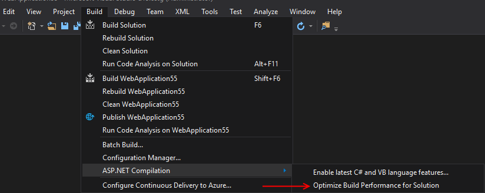

# Optimize build performance for solution
In Visual Studio 2017 15.8 we added a new menu item under Build | ASP.NET Compilation | Optimize Build Performance for Solution

This new menu item is applicable to solutions containing ASP.NET Framework projects only and is not applicable to ASP.NET Core projects. Its purpose is to update specific ASP.NET related NuGet packages referenced by the codebase. 

When an ASP.NET Framework codebase is using out-of-date packages, the inner loop performance of Visual Studio is impacted. The motivation behind updating these packages is to restore optimal inner loop performance for a given solution.

You will only have to do this once per solution and you will not have to deal with this problem in the future since the new package is designed in a way that even when it gets out of date it doesn’t affect the inner loop performance in Visual Studio.
