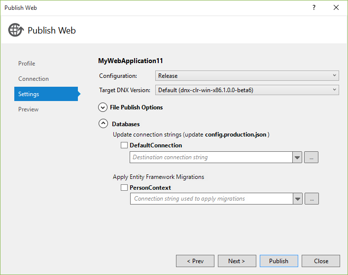
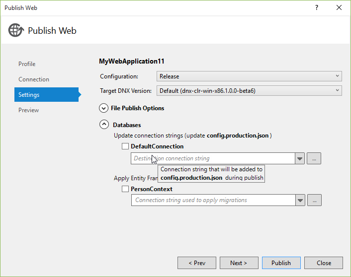
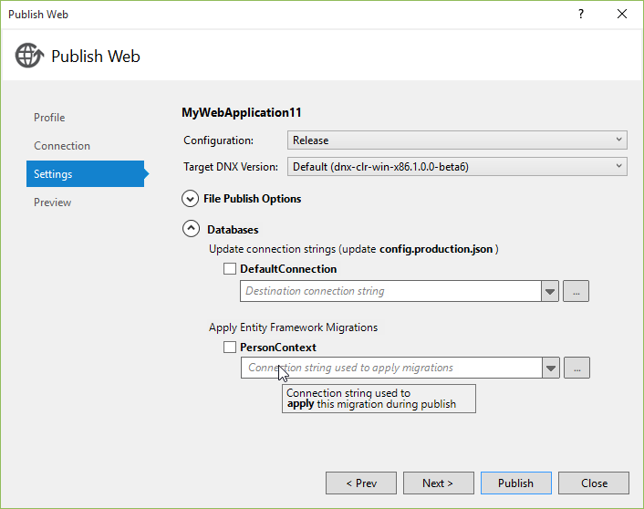
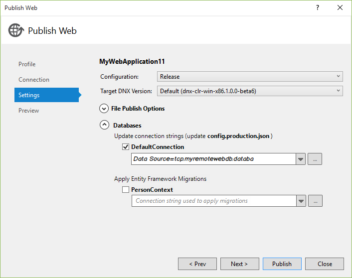
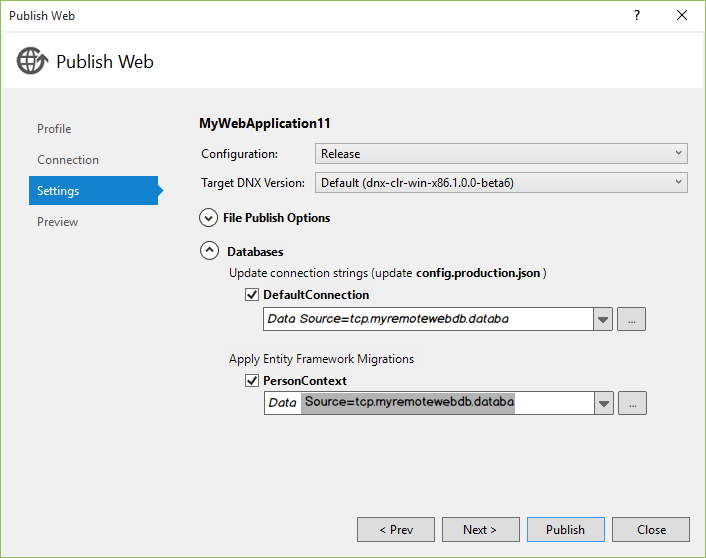
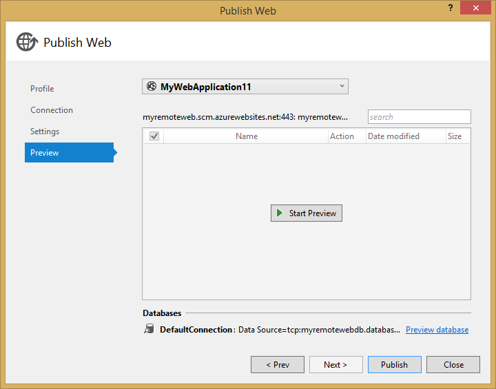
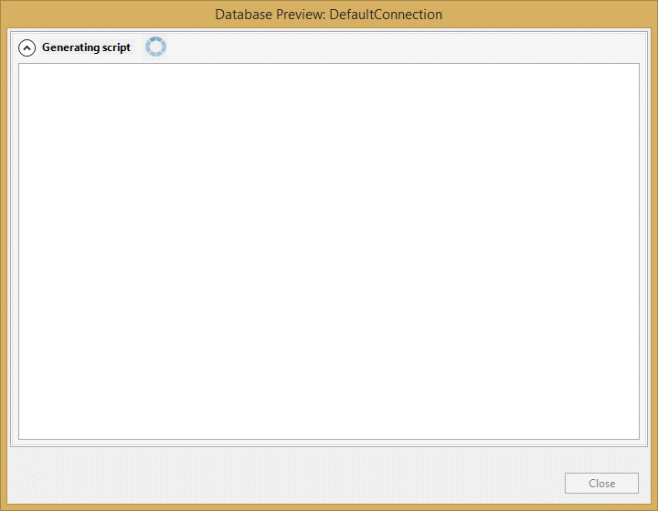
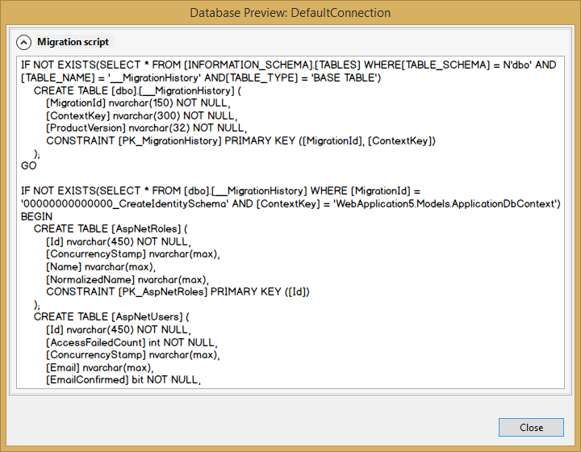

For ASP.NET 4 we had the ability to allow users to select a database and have Entity Framework Migrations executed. In ASP.NET 4 the migrations were executed at runtime. When selecting a DB on the publish dialog when the web app was published `web.config` was modified to execute migrations at runtime when the app starts. In EF 7 executing migrations will no longer be supported. Instead migrations will be executed during deploy time. For more details on this see the EF 7 wiki for [Visual Studio Integration](https://github.com/aspnet/EntityFramework/wiki/Visual-Studio-Publish-Integration).

Below is the proposal for the experience for ASP.NET 5 projects.

When a publish profile is created we will automatically start discovering the contexts available by calling `dnx ef context list` to get the list of contexts. While this is happening we should show a spinner to indicate that something is happening. See the following image.


After the results have come back here is what the `DefaultConnection` entry looks like.



We have the same default behavior as ASP.NET 4, updating connecting string is enabled by default but executing code first migrations must be explicitly set by the user. After the item is configured for EF migrations then it will be enabled for publish and preview.

For the case that the user is publishing and there is no linked DB (or publishing to some host besides Azure Web Apps), the DB connection string will not be populated automatically. We'll have tooltips which explain each text box better. See images below.





Note: on this dialog we have a refresh button that can be used to re-discover any newly added DB entry. Today for ASP.NET 4 we auto refresh this list. We have not yet settled on continuing the auto-discovery or moving to a model where users have to click refresh. We may hold off on deciding that until we can try out the experience.



When a user enters a connection string into any text box, it will be available for autocomplete in other connection string dropdowns.



On the preview tab we will have the same UX as we do for ASP.NET 4 projects.


When the DB preview link is clicked we should show the migration script in a separate dialog like we do today. The screenshots below show the experience. We can use `dnx ef migration script -i -o` to get the script for preview.





## Publish actions
When `Publish` is clicked at a high level the following actions are preformed.
 - `config.$(TargetEnvName).json` is created if it doesn't already exist and published to the remote site during deployment. The artifact is **not** added to the project. If the file already exists then we will update/add the connection string.
  - Note: `$(TargetEnvName)` is the environment name that we are publishing to. The default value should be `Production`. Users should be able to customize this in the `.pubxml` file. For now we are not planning to add any UI for this, but that may change later.
 - Generate a migration script using `dnx ef migration script -i -o`
 - Publish by creating a web deploy manifest
  - `dbFullSql` to execute the migrations `.sql` script
  - `iisApp` to create the website
  - Create parameters for important values like connection string  

## .pubxml and PowerShell

We can persist the values in the `.pubxml` with a format similar to the following.


```xml
<ItemGroup>
    <ConnectionStringUpdates Include="DefaultConnection">
      <Type>config.json</Type>
      <Name></Name>
      <Value>$(DefaultConnection_ConString)</Value>
    </ConnectionStringUpdates>
    <EfMigrations Include="ApplicationDbContext">
      <Name>ApplicationDbContext</Name>
      <Value>$(ApplicationDbContext_ConString)</Value>
    </EfMigrations>
    <EfMigrations Include="BookContext">
      <Name>BookContext</Name>
      <Value>$(BookContext_ConString)</Value>
    </EfMigrations>
  </ItemGroup>

```

When the data is passed from Visual Studio/MSBuild to the publish PowerShell script we can place the info into the `PublishProperties` array using the following structure.

```powershell
Publish-AspNet -packOutput $packOutput -publishProperties @{
    'WebPublishMethod'='MSDeploy'
    'MSDeployServiceURL'='contoso.scm.azurewebsites.net:443'
    'DeployIisAppPath'='contoso';'Username'='$contoso';'Password'="$env:PublishPwd"
    'ExcludeFiles'=@(
        @{'absolutepath'='wwwroot\\test.txt'},
        @{'absolutepath'='wwwroot\\_references.js'}
    )
    'ConnectionStringUpdates'=@(
        @{
            'ContextName'='MusicStore.Models.MusicStoreContext'
            'DestConString'='<dest-con-string>'
            'ProjectFolderPath'='<path-to-project>'
        },
        @{
            'Type'='Script'
            'ScriptPath'='c:\temp\path\to\script.sql'
            'DestConString'='<dest-con-string'
        }
    )

}
```

